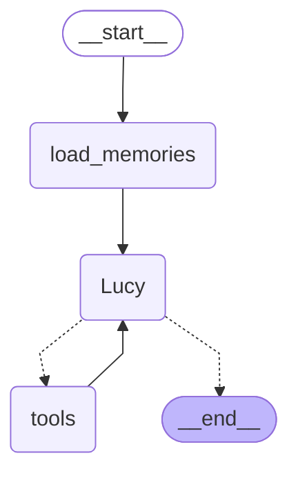

```mermaid
%%{init: {'flowchart': {'curve': 'linear'}}}%%
graph TD;
	__start__([<p>__start__</p>]):::first
	load_memories(load_memories)
	Lucy(Lucy)
	tools(tools)
	__end__([<p>__end__</p>]):::last
	__start__ --> load_memories;
	load_memories --> Lucy;
	tools --> Lucy;
	Lucy -.-> tools;
	Lucy -.-> __end__;
	classDef default fill:#f2f0ff,line-height:1.2
	classDef first fill-opacity:0
	classDef last fill:#bfb6fc

```